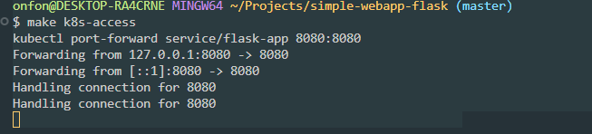
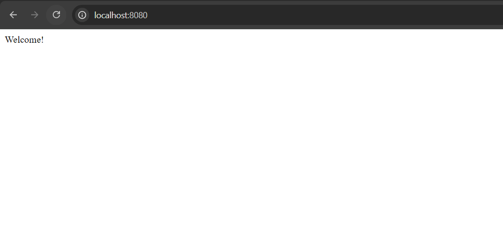
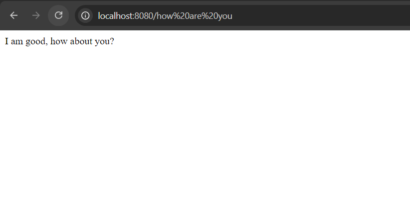

## Project Summary

This project is a simple Flask API that includes two endpoints:
- **GET /**: Returns `"Welcome!"`.
- **GET /how are you**: Returns `"I am good, how about you?"`.

The application is containerized using Docker and deployed to a Kubernetes cluster managed by `kind`. The deployment is automated using a CI/CD pipeline configured with GitHub Actions. Security measures such as image vulnerability scanning, resource limits, Kubernetes secrets, and network policies are also implemented to ensure the robustness of the system.

## Makefile
This is a file that contains all the commands necessary to run the application

## 1: Deploy to K8s
The Flask app is containerized using Docker. The Dockerfile defines the process of packaging the app, installing dependencies, and running the app inside a container.

To build and run the docker image locally:
  make build TAG=v0.1
  make run

# Kubernetes Setup 

Using `kind` to create a local Kubernetes cluster for testing and deploying the Flask app.(kind to be installed and added to path in environment variables)
    make k8s-setup

The Kubernetes manifests is composed of:
- **Deployment**
The deployment is configured to run two replicas (pods) of the Flask app at all times, ensuring redundancy and enabling scaling. It targets pods labeled flask-app to manage traffic to the correct pods.
The pod template specifies the following configuration:
Container: A container named flask-app uses the image jaycynth/flask-app:v0.1 and listens on port 8080.
Resource Requests and Limits:
Requests: The container requests 128Mi of memory and 250m (0.25 CPU) to guarantee it has the necessary resources.
Limits: The container is restricted to a maximum of 256Mi of memory and 500m (0.5 CPU) to prevent overconsumption of cluster resources.

- **Service**
The Flask app runs inside the pods on port 8080. 
The service is configured to listen on port 8080 within the Kubernetes cluster and routes traffic to all pods labeled flask-app, as defined in the Deployment manifest. 
The service is of type NodePort which will expose the Flask app externally, allowing access from outside the cluster

# Deploy the Application
To deploy the Flask app using the Kubernetes manifests:
    make k8s-deploy

Check if pods are up and running:
    make k8s-get-nodes

Check if services
    make k8s-get-services

Forward the service port to access the application and visit http://localhost:8080.
    make k8s-access

