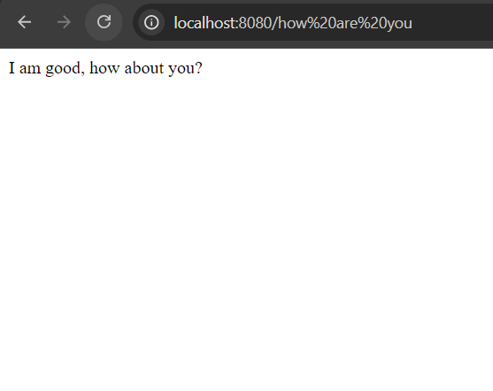

# Project Summary

This project is a simple Flask API that includes two endpoints:
- **GET /**: Returns `"Welcome!"`.
- **GET /how are you**: Returns `"I am good, how about you?"`.

The application is containerized using Docker and deployed to a Kubernetes cluster managed by `kind`. The deployment is automated using a CI/CD pipeline configured with GitHub Actions.
The security measures implemented are image vulnerability scanning and resource limits.

## Makefile
This is a file that contains all the commands necessary to run the application

# 1: Deploy to K8s
The Flask app is containerized using Docker. 

## Dockerize Application 
- Specified a Dockerfile to package the application and run it in a local Python WSGI HTTP server using Gunicorn

- To build, tag and push the docker image:
  - make build_service TAG=v0.1
  

## Kubernetes Setup 

Used `kind` to create a local Kubernetes cluster for testing and deploying the Flask app. Kind is installed and added to path in environment variables.
  - make k8s-setup

The Kubernetes manifests are located in the folder /k8s is composed of:

### **Deployment** 
- The deployment is configured to run two replicas (pods) of the Flask app at all times, ensuring redundancy and enabling scaling. It targets pods labeled flask-app to manage traffic to the correct pods.
- The pod template specifies the following configuration:
 1. Container: A container named flask-app uses the image jaycynth/flask-app:v0.1 and listens on port 8080.
 2. Resource Requests and Limits: The container requests 128Mi of memory and 250m (0.25 CPU) to guarantee it has the necessary resources and the container is restricted to a maximum of 256Mi of memory and 500m (0.5 CPU) to prevent overconsumption of cluster resources.

### **Service**
- The Flask app runs inside the pods on port 8080. 
- The service is configured to listen on port 8080 within the Kubernetes cluster and routes traffic to all pods labeled flask-app, as defined in the Deployment manifest. 
- The service is of type NodePort which will expose the Flask app externally, allowing access from outside the cluster

## Deploy the Application
To deploy the Flask app using the Kubernetes manifests:
- make k8s-deploy

Check if pods are up and running:
- make k8s-get-nodes

Check if services:
- make k8s-get-services

Forward the service port to access the application and visit http://localhost:8080:
- make k8s-access

# 2: Setup CI/CD

## Workflow Triggers
The workflow is triggered on two events:
- Whenever code is pushed to the main branch.
- Whenever a pull request is created targeting the main branch.

## Jobs
The workflow consists of four main jobs: test, build, docker and deploy.

### 1. Test Job
- This job is responsible for running tests setup in the tests folder using pytest

### 2. Build Job
- Depends on the test job
- This job builds the application and performs linting and manifest validation.
    - Runs flake8 on app.py to check for code style issues.
    - Uses the instrumenta/kubeval-action@master to validate Kubernetes manifest files in the k8s directory.

### 3. Docker Job
- Depends on the build job
- This job builds the flask image (jaycynth/flask-app:v0.1)
- Scans Docker Image for Vulnerabilities by running Trivy as a Docker container to scan the built image (jaycynth/flask-app:v0.1).
  If vulnerabilities are found at or above the specified severity levels (HIGH and CRITICAL), the command will exit with a non-zero status, which will fail the job.
- Pushes the Docker image to Docker Hub.(Used GitHub Secrets to store docker hub registry credentials)

### 4. Deploy Job
- Depends on the Docker job
- Downloads and installs Kind, which will allows to create a local Kubernetes cluster.
- Creates a new Kubernetes cluster using Kind.
- Check Kubernetes Cluster Status by running kubectl cluster-info dump to get information about the cluster status.
- Applies the Kubernetes manifests for deployment and service using kubectl, ensuring that the application is running in the cluster.

